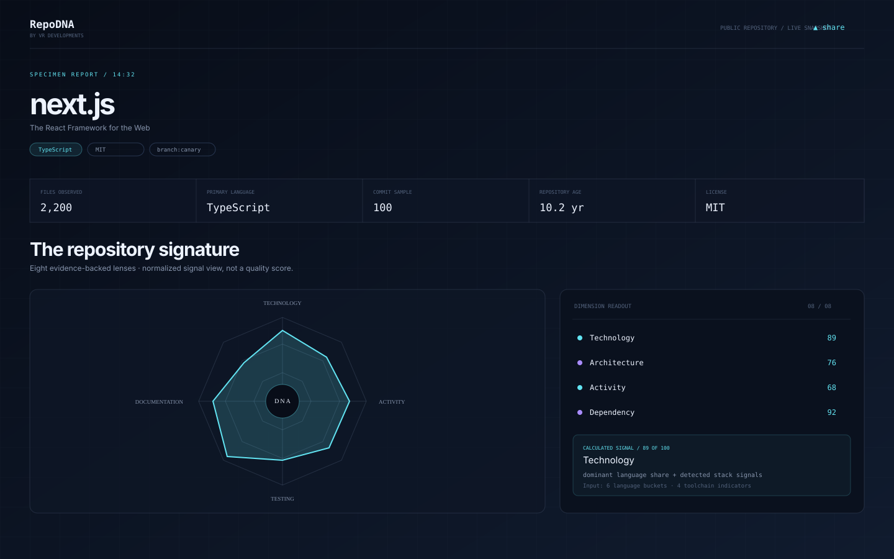

# RepoDNA

> **Decode the DNA of any repository.**
>
> A local-first, open-source microscope for public GitHub repositories by **VR Developments**.




RepoDNA takes a public GitHub repository URL and turns its structure, technology choices, development activity, dependencies, documentation, testing signals, collaboration surface, and evolution into an interactive DNA profile.

This is intentionally **not** a generic GitHub statistics dashboard. The central question is: *what can the public evidence tell us about the way this repository is built and maintained?*

## What it analyzes

RepoDNA requests only public GitHub REST API data and calculates the profile in the browser:

- repository metadata, age, push recency, license, stars, forks, and default branch
- GitHub language byte distribution
- recursive file tree, topology, depth, root surface, largest files, and project size
- common package manifests and a small declared dependency overview
- public commit sample and transparent recent cadence calculation
- visible contributors, branch rows, releases, and tags
- README, docs, markup, test paths, test configuration, CI/CD, and toolchain indicators
- an optional file-churn read from the latest 15 commit file lists
- an optional code-growth chart from GitHub's historical statistics endpoint

The signature has eight lenses: **Technology, Architecture, Activity, Dependency, Documentation, Testing, Evolution, and Collaboration**. Each lens exposes the observed inputs, its calculation, and important caveats. The normalized values are signal visualizations, not quality scores.

## Start locally

Requirements: a modern browser, Python 3, and network access to `api.github.com` for live scans.

```bash
git clone https://github.com/your-org/reprodna.git
cd reprodna
python3 -m http.server 4173 --bind 0.0.0.0
# open http://localhost:4173
```

Or use the included script:

```bash
npm start
```

No build step, database, server-side secret, OAuth app, credit card, or paid API is needed. The static app can be deployed to GitHub Pages, Netlify, Cloudflare Pages, or any static host.

Run the lightweight regression tests:

```bash
npm test
```

## Privacy and GitHub limits

- RepoDNA never requests repository write permissions and has no authentication flow.
- Repository data is requested directly from GitHub by your browser and computed locally.
- It does not upload repository contents to a RepoDNA server.
- It uses unauthenticated public GitHub REST API requests. GitHub's rate limit is surfaced in the report when the response provides it.
- The default scan is deliberately bounded: one repository metadata request, seven parallel public endpoints, and at most five small manifest reads from `raw.githubusercontent.com`. Small metadata responses are cached in the browser session for five minutes; recursive trees and commit details are not cached.
- Expensive file-history and code-frequency reads are opt-in and lazy. If GitHub returns incomplete or deferred data, RepoDNA says so instead of estimating.

## Export and sharing

- **PNG / SVG** export the DNA signature directly from the browser.
- **Share** copies a URL containing `?repo=owner/repository`; it does not require a backend or database.
- The share URL re-runs a fresh public scan when opened.

## Project layout

```text
.
├── index.html                 # semantic application shell
├── styles.css                 # dark-first responsive product UI
├── app.js                     # API client, analysis engine, renderer, exports
├── tests/app.test.js          # pure logic smoke tests
├── docs/ARCHITECTURE.md       # data flow and metric definitions
├── docs/screenshots/          # repository-safe illustrative interface image
├── CONTRIBUTING.md
├── SECURITY.md
├── LICENSE
└── .github/
    ├── workflows/ci.yml
    └── ISSUE_TEMPLATE/
```

## Data language

RepoDNA uses three evidence labels:

- **Observed** — returned directly by GitHub or found at a concrete repository path.
- **Calculated** — a deterministic count, ratio, or normalized signal computed from observed values.
- **Inferred** — a bounded pattern suggested by multiple observations, with a caveat shown beside it.

No AI-generated repository claims are presented as facts. File names are not treated as proof that a test passes, a framework is used at runtime, or a codebase is healthy.

## Contributing

See [CONTRIBUTING.md](CONTRIBUTING.md). Small, focused pull requests are welcome, especially improvements to parsers, accessibility, API efficiency, and tests for incomplete GitHub responses.

## License

RepoDNA is released under the [MIT License](LICENSE).
